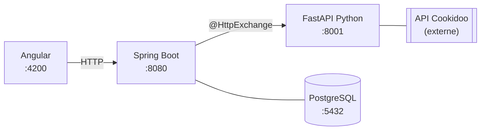

# My Cookidoo

> **Avertissement** : Cette application est un projet personnel indépendant et n'est affiliée, ni approuvée, ni sponsorisée par Vorwerk ou Thermomix. Cookidoo® est une marque déposée de Vorwerk. L'utilisation de cette application se fait à titre personnel, sans aucun lien officiel avec les produits ou services de Thermomix.

> La documentation complète est disponible dans [Antora](#documentation-antora).

## Architecture



| Composant           | Rôle                                              | Technologie                            |
|---------------------|---------------------------------------------------|----------------------------------------|
| `cookidoo-service`  | Wrapper autour de l'API Cookidoo non-officielle   | Python 3.12 · FastAPI · cookidoo-api  |
| `backend`           | API REST, persistance, synchronisation planifiée  | Java 25 · Spring Boot 3.4 · PostgreSQL 17 |
| `frontend`          | Interface utilisateur                             | Angular 21 · TailwindCSS 4            |

## Prérequis

- [Podman](https://podman.io/) + podman-compose
- Java 25
- Maven 3.9+
- Node.js 22+
- Python 3.12+

## Démarrage

### 1. Variables d'environnement

```bash
cp .env.example .env
# Renseigner COOKIDOO_EMAIL et COOKIDOO_PASSWORD
```

### 2. Infrastructure (PostgreSQL + pgAdmin + microservice Python)

```bash
podman compose up -d
```

| Service          | URL                                             |
|------------------|-------------------------------------------------|
| PostgreSQL       | `localhost:5432`                                |
| pgAdmin          | http://localhost:5050 (admin@gmail.com / admin) |
| cookidoo-service | http://localhost:8001/health                    |

### 3. Backend Spring Boot

**Mode JVM (développement)**

```bash
mvn spring-boot:run -pl backend
```

**Mode natif GraalVM (production)**

Prérequis : [GraalVM 25](https://www.graalvm.org/downloads/) avec `native-image` installé, ou Docker/Podman pour le build via Buildpacks.

```bash
# Compiler un binaire natif (GraalVM requis localement)
mvn -Pnative native:compile -pl backend
./backend/target/kitchen-vault   # démarrage < 200 ms

# Construire une image OCI via Buildpacks (pas besoin de GraalVM local)
mvn -Pnative spring-boot:build-image -pl backend
podman run -p 8080:8080 backend:1.0.0-SNAPSHOT

# Construire une image via Dockerfile multi-stage
podman build -f backend/Dockerfile -t kitchen-vault:native .
podman run -p 8080:8080 kitchen-vault:native
```

- API : http://localhost:8080
- Swagger UI : http://localhost:8080/swagger-ui.html

### 4. Frontend Angular

```bash
cd frontend
npm install
npm run generate:api   # génère le client depuis api.yaml
npm start
```

- Application : http://localhost:4200
- Interface d'administration : http://localhost:4200/admin

### Lancer une synchronisation

```bash
# Via curl
curl -X POST http://localhost:8080/api/v1/sync

# Vérifier le statut
curl http://localhost:8080/api/v1/sync/latest
```

## Tests

```bash
# Backend (JUnit 5 + Testcontainers + AssertJ-DB)
./mvnw test

# Frontend (unitaires)
cd frontend && ng test

# Frontend E2E (Cypress — nécessite `npm start` dans un autre terminal)
cd frontend && npm run e2e          # headless
cd frontend && npm run e2e:open     # mode interactif (GUI)

# Python
cd cookidoo-service && python -m pytest
```

## Documentation Antora

La documentation technique détaillée (architecture, modèle de données, API, flux de synchronisation) est générée avec [Antora](https://antora.org/) depuis le dossier `docs/`.

```bash
cd docs
npm install
npm run serve   # build + serveur HTTP → http://localhost:8888
```

Les diagrammes (architecture, flux, ERD) sont générés automatiquement en SVG depuis le code PlantUML via [Kroki](https://kroki.io/).

## Structure du projet

```
KitchenVault/
├── compose.yaml              # Infrastructure Podman
├── pom.xml                   # Parent Maven multi-module
├── contracts/                # Contrat OpenAPI (api.yaml) — source of truth
├── backend/                  # Application Spring Boot
├── cookidoo-service/         # Microservice Python FastAPI
├── frontend/                 # Application Angular
└── docs/                     # Documentation Antora
```
