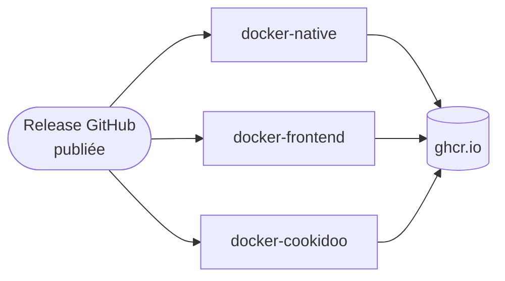
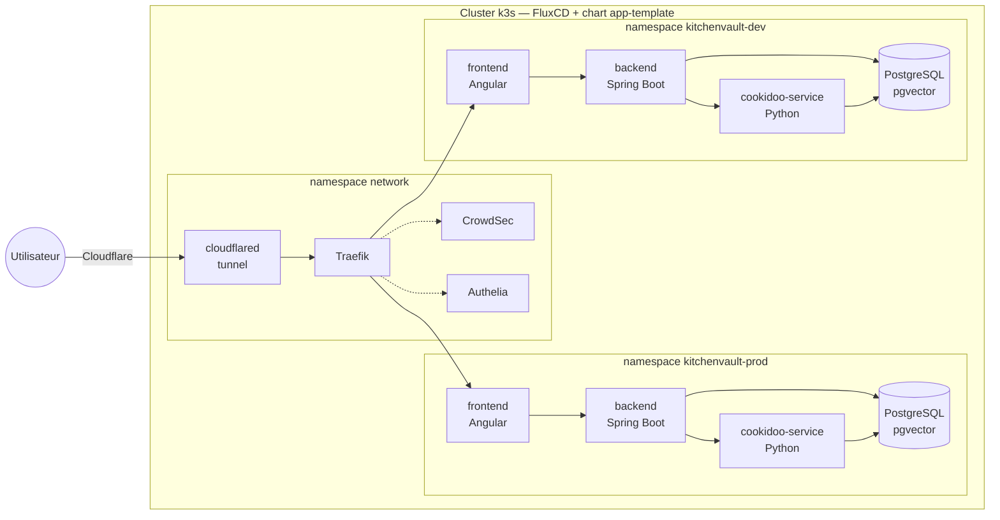

# Chapter dev - 23/09/2026

## Retour d'expérience sur le dev 100% agentique d'une application Spring Boot / Angular que j'utilise au quotidien

---
layout: section
---

# Le projet

## KitchenVault

« Chaque semaine, la même question revient : qu'est-ce qu'on mange ?
 Et une fois qu'on y a répondu : qu'est-ce qu'il faut au marché et aux courses ? »

---

# KitchenVault en deux mots

Application auto-hébergée de gestion de recettes synchronisée avec l'application **Cookidoo**.

**Stack applicative**

- Backend : Spring Boot 4 - Java 25
- Frontend : Angular 21
- Microservice Cookidoo : Python FastAPI 
- Base de données : PostgreSQL + pgvector
- Approche contract first pour l'API REST

**Fonctionnalités principales**

- Catalogue de recettes synchronisé de façon bidirectionnelle avec Cookidoo
- Gestion d'un planning hebdomadaire
- Proposition de recettes et création d'un menu complet par un assistant IA
- Création de liste de courses consolidée par IA

---
layout: statement
---

# Ce dont on ne va **pas** parler aujourd'hui

L'assistant IA de planification de menus, LangChain4J, les agents spécialisés.

Aujourd'hui : uniquement <strong>comment</strong> j'ai développé

---

# Le projet en chiffres

**123**
 commits

**16**
 PRs mergées

**10**
 releases

**~70**
 builds d'images Docker (CI, 3 workflows)

**~13 800**
 lignes de code (Java + TypeScript + Python)

**~240**
 tests automatisés

---

# Du code à la CI...

Publication d'une **release GitHub** → 3 workflows GitHub Actions construisent et publient les images Docker sur GHCR

**3 workflows, un par image**
- `docker-native.yml` — backend Spring Boot natif GraalVM
- `docker-frontend.yml` — frontend Angular
- `docker-cookidoo.yml` — microservice Python

**Déclenchement**
- `release: published` → tags semver
- `workflow_dispatch` → tag manuel

+ un 4e workflow (<code>docs.yml</code>) déploie la documentation Antora sur GitHub Pages à chaque push sur <code>main</code> touchant <code>docs/</code>.

---

# ...jusqu'au déploiement

Le déploiement sur Kubernetes (repo séparé `k3s-at-home`)

---
layout: section
---

# Le développement du projet

## Phase par phase

---

# 29 mars — le bootstrap, en 1 jour

Repo vide le matin, application complète le soir : <strong>~30 commits</strong> le même jour.

- `docker-compose` — PostgreSQL, pgAdmin, `cookidoo-service`
- Microservice Python FastAPI autour de `cookidoo-api`
- Architecture multi-module Maven — `contracts` (OpenAPI) + `backend`
- Backend Spring Boot : entités JPA, migrations Liquibase, client HTTP Cookidoo
- Tests unitaires et d'intégration
- Frontend Angular 21 + TailwindCSS 4, premier écran d'admin
- Documentation Antora, README, `CLAUDE.md`

Le socle complet — 4 couches, tests et documentation compris.

 

Objectif : Socle technique et documentaire.

---

# 30 mars → 21 avril — features et industrialisation

**Premières features métier**
 Recherche et consultation des recettes, filtres par collection et par ingrédient, affichage nutritionnel

**Documentation technique sur GitHub Pages**
 Documentation Antora déployée automatiquement sur GitHub Pages

**Compilation native GraalVM**
 Migration Spring Boot 3.5.13 → 4.0.5
 Support de la compilation native, premier build sans JVM au démarrage

**3 workflows Docker**
 GitHub Actions pour les 3 images : backend natif, `cookidoo-service`, frontend

 

Objectifs : Socle fonctionnel nécessaire à l'assistant IA et déploiement sur environnements.

---

# 23-24 avril — Issue → PR

- Premier vrai cycle complet - <strong>Issue #1 → PR #3</strong> : le planning hebdomadaire de menus.
- Mise en place de Cypress et premier test E2E

 

Objectifs : Évolution de la méthode de spécification / réalisation.

---

# 24 avril → 6 mai — branding et assistant IA

- **PR #5** : Renommage en KitchenVault
- **PR #6** : Dark mode et identité visuelle
- **PR #8** - Assistant IA culinaire : LangChain4J, embeddings de recettes, planification IA hebdomadaire
- **4-5 mai** - ~22 commits en 2 jours pour stabiliser le build natif GraalVM

 

Objectifs : Mise en place de l'assistant IA.

---

# 13-25 mai — un sprint dense

- **PR #10** : Liste de courses + consolidation IA
- **25 mai** - 4 PRs mergées le même jour :
  - **PR #11** : Synchro du planning vers Cookidoo
  - **PR #12** : Responsive mobile, PWA
  - **PR #13** : Export email de la liste
  - **PR #14** : Polish UX liste de courses
- Puis silence sur `main` jusqu'au 12 août — pause estivale

 

Objectifs : Rendre l'application utilisable au quotidien.

---

# 13 → 30 août — la reprise

- **PR #20** : Déplacer une recette planifiée
- **PR #21** : Synchro descendante Cookidoo
- **PR #22-24** : Corrections de synchro montante
- **PR #25** : Listes de recettes personnalisables
- **PR #26** : Copier les ingrédients dans le presse-papier
- Documentation Antora réalignée avec le code

 

Objectifs : Nouvelles features et consolidation, avec une méthode désormais rodée.

---
layout: section
---

# Retour d'expérience sur la méthode utilisée

---

# Les bases de la méthode

**Le mode Plan**
 Cadrage fonctionnel avant tout code

**Un worktree = une tâche**
 Isolation, jamais un fil qui dérive

**Build / review séparés**
 Un reviewer en contexte neuf

**Autonomie sur la boucle de rétroaction**
 Donner les outils et CLI plutôt qu'un copier-coller

**Méthode spec first**
 Cadrer via une issue GitHub ou une page de documentation, point d'entrée d'une nouvelle
session dédiée à l'implémentation

**Documentation à jour**
 Vérifier la doc réelle d'une lib avant de l'utiliser, plutôt que la mémoire d'entraînement du modèle

---
layout: center
---

# Le mode Plan n'est pas seulement un moyen d'économiser des tokens

## C'est un outil de cadrage **fonctionnel**

Savoir exactement ce qu'on veut faire — pas seulement comment le coder —
<strong>avant</strong> d'écrire la moindre ligne.

---

# Rester en mode plan et itérer

- Rester en mode plan tant que l'objectif et la méthode ne sont pas **cadrés précisément**
- Utiliser la **technique de l'entonnoir**
- **Challenger ses propres idées** : l'IA questionne et co-construit la spécification, elle ne se contente pas de valider un plan.
- Pour aller plus loin dans le détail : demander à passer en **mode interview**

---

# Un exemple de pattern

- Cadrer une feature en mode plan jusqu'à produire une <strong>issue GitHub</strong>
- Challenger cette issue dans une <strong>nouvelle session</strong>
- Démarrer une <strong>nouvelle session</strong> qui lit l'issue pour produire un plan d'implémentation et itérer sur ce plan au besoin pour finir par l'implémentation

**Session 1 Mode Plan**
 Cadrage

→ produit

**Issue GitHub**
 Spécifications structurées

→ nouvelle session

**Session 2**
 Challenge de l'issue

→ issue amendée

**Session 3 Mode Plan**
 Plan d'implémentation ↻ itérations

→ plan validé

**Session 3**
 Implémentation

Sépare nettement <strong>décider quoi faire et comment</strong> de <strong>l'écrire</strong>.

---

# Même entonnoir, à plus grande échelle

La même méthode que l'issue #1, mais sur la plus grosse feature du projet — l'assistant IA.

**Issue #2**
 Spécifications initiales

**Challenge de spécification**
 8 points arbitrés

**Complément de spécifications**
 approfondissement fonctionnel

→ reconsolidation

**Issue #7**
 Spécification consolidée
 remplace l'issue #2

→ implémentation

**PR #8**
 71 fichiers
 +5204 / -290

La spécification est challengée et enrichie <strong>dans l'issue</strong>, puis reconsolidée avant la moindre ligne de code.

---

# Les mêmes accès qu'un dev humain pour le harness

Chaque fois qu'une information existe ailleurs — CI, cluster, API tierce — donner l'outil pour aller la chercher, plutôt que copier-coller un log dans le chat.

**Utilisés dans le projet**
 <code>gh</code> CLI (PR, issues), extension Chrome (maquettes, capture visuelle), MCP de design.

**Le même principe, ailleurs**
 <code>gh run</code> pour inspecter un run GitHub Actions qui échoue, <code>kubectl</code> pour lire
les logs d'un pod sur l'environnement de dev.

---

# S'appuyer sur la documentation, pas sur la mémoire du modèle

Le modèle a une date de coupure, les librairies évoluent : Context7 (MCP) récupère la doc à jour
avant de l'utiliser.

Sur ce projet : la mise en place de LangChain4J (PR #8) s'est appuyée sur Context7 pour
vérifier la doc à jour du framework — plutôt que sur les connaissances d'entraînement du modèle.

Une règle globale (<code>~/.claude/rules/context7.md</code>) l'impose pour toute lib, framework ou
SDK cité — même ceux qu'on croit bien connaître.

---

# Les autres piliers

 

- **Un worktree = une tâche**
 Chaque session sérieuse dans un worktree git dédié. Isolation, parallélisation possible.

- **Build et review, sessions séparées**
 Un reviewer en contexte neuf n'a que le diff et les critères, pas le raisonnement qui a produit le changement.

---
layout: section
---

# Cas concrets
## 2 features, une revue

---
layout: section
---

# Cas A

## De la maquette au code

---

# PR #20 — Déplacer une recette planifiée

13 août 2026 · mode "Attraper" dans le planning hebdomadaire

1. **Maquette d'abord, dans Claude Design** — chat + prévisualisation live, itérée
   avant d'ouvrir Claude Code
2. **Implémentation complète** : endpoint `PATCH` atomique dédié (backend), mode "Attraper"
   (frontend)
3. **Session de revue dédiée séparée**, avant merge

Claude Design — maquette KitchenVault avant passage à Claude Code

L'agent part d'un artefact visuel comme le ferait un dev humain qui reçoit une maquette
Figma — pas seulement d'un ticket texte.

---
layout: section
---

# Cas B

## L'étude de faisabilité avant le code

---

# PR #21 — Synchro descendante Cookidoo

1. **Session d'étude de faisabilité** à part entière, avant d'écrire la moindre ligne —
   explorer l'API tierce Cookidoo, valider que la sync inverse (pull) est possible
2. **Implémentation complète multi-couches, en une session** : microservice Python →
   contrats OpenAPI → backend Spring (delegate, mapping, persistance) → frontend Angular
3. Mise en production

---
layout: center
---

# Sur un sujet ambigu ou risqué...

## ...une phase de faisabilité dédiée *avant* l'implémentation change la donne

L'agent explore et rapporte, l'humain valide l'approche, puis l'implémentation part sur des rails clairs.

---
layout: section
---

# Revue de code

## La review : un rôle à part entière

---

# Revue de la PR #25

Une session dédiée exécute la skill <code>/review</code> sur la PR #25 (3 listes de
recettes) et applique les corrections identifiées — dans une session **distincte** de
celle qui a construit la feature.

La revue de code est un <strong>rôle agentique à part entière</strong>, pas une passe de
relecture confondue avec l'implémentation — même agent, casquette différente, session
différente.

---
layout: section
---

# Takeaway

---

# Takeaway

- **Mode Plan** pour cadrer le quoi avant le comment — pas juste avant du code compliqué,
  avant tout ce qui compte
- **Mode Plan pour challenger ses idées** : l'IA questionne et co-construit la spec, elle ne
  se contente pas de la valider
- **Un worktree par tâche** : pour paralléliser les tâches
- Donner les mêmes outils au harness qu'à un humain (CLI, MCP) : boucle de rétroaction autonome.
- **Documentation à jour** (Context7/MCP) : vérifier plutôt que faire confiance à la mémoire du modèle
- **Sur les sujets complexes ou ambigus** : cadrer en entonnoir, voire lancer une phase de faisabilité dédiée avant d'implémenter
- **La revue comme session séparée**, pas une relecture confondue avec le build

---
layout: statement
---

# La suite ?

## Utiliser l'IA dans une application

Assistant IA, RAG, agents métier, ...

---
layout: center
class: text-center
---

# Merci
## Des questions ?
