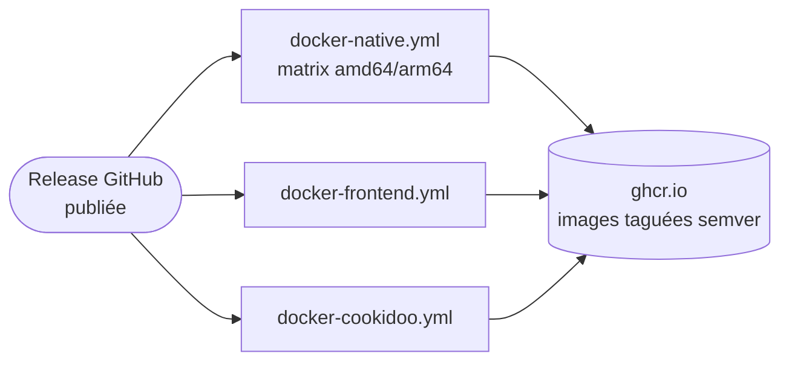
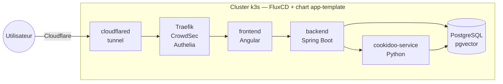

# Chapter dev - 23/09/2026

## Retour d'expérience sur le dev 100% agentique d'une application Spring Boot / Angular que j'utilise au quotidien

---
layout: section
---

# Le projet

## KitchenVault

<div class="pt-10 text-xl italic opacity-80 max-w-xl mx-auto leading-relaxed">
« Chaque semaine, la même question revient : qu'est-ce qu'on mange ?
<br>Et une fois qu'on y a répondu : qu'est-ce qu'il faut au marché et aux courses ? »
</div>

---

# KitchenVault en deux mots

Application auto-hébergée de gestion de recettes synchronisée avec l'application **Cookidoo**.

<div class="grid grid-cols-2 gap-8 pt-6">
<div>

**Stack applicative**

- Backend : Spring Boot 4 - Java 25 - compilation native GraalVM
- Frontend : Angular 21
- Microservice Cookidoo : Python FastAPI 
- Base de données : PostgreSQL + pgvector
- Approche contract first : OpenAPI → interfaces et DTO Spring Boot + services Angular

</div>
<div>

**Fonctionnalités principales**

- Catalogue de recettes synchronisé de façon bidirectionnelle avec Cookidoo
- Gestion d'un planning hebdomadaire
- Proposition de recettes et création d'un menu complet par un assistant IA
- Création de liste de courses consolidée par IA

</div>
</div>

---
layout: statement
---

# Ce dont on ne va **pas** parler aujourd'hui

L'assistant IA de planification de menus, LangChain4J, les agents spécialisés.

<div class="pt-4 text-xl opacity-80">
Aujourd'hui : uniquement <strong>comment</strong> j'ai développé avec Claude Code.
</div>

---

# Le projet en chiffres

<div class="grid grid-cols-3 gap-4 pt-6 text-center">
<div class="p-4 rounded border border-gray-500/30">

**123**
<br><span class="text-sm opacity-70">commits</span>

</div>
<div class="p-4 rounded border border-gray-500/30">

**16**
<br><span class="text-sm opacity-70">PRs mergées</span>

</div>
<div class="p-4 rounded border border-gray-500/30">

**10**
<br><span class="text-sm opacity-70">releases</span>

</div>
<div class="p-4 rounded border border-gray-500/30">

**~70**
<br><span class="text-sm opacity-70">builds d'images Docker (CI, 3 workflows)</span>

</div>
<div class="p-4 rounded border border-gray-500/30">

**~13 800**
<br><span class="text-sm opacity-70">lignes de code (Java + TypeScript + Python)</span>

</div>
<div class="p-4 rounded border border-gray-500/30">

**~240**
<br><span class="text-sm opacity-70">tests automatisés</span>

</div>
</div>

<div class="pt-8 text-sm opacity-60 text-center">
~5 mois · 15 migrations de schéma · <strong>un seul développeur humain</strong> — le reste, c'est Claude Code.
</div>

---

# Du code à la CI

Publication d'une **release GitHub** → 3 workflows GitHub Actions construisent et publient les images Docker sur GHCR

<div class="grid grid-cols-2 gap-6 pt-4 text-sm">
<div>

**3 workflows, un par image**
- `docker-native.yml` — backend Spring Boot natif GraalVM (matrix amd64/arm64, puis merge en manifest multi-arch)
- `docker-frontend.yml` — Angular
- `docker-cookidoo.yml` — microservice Python

</div>
<div>

**Déclenchement**
- `release: published` → tags semver (`{{version}}`, `{{major}}.{{minor}}`, `latest`)
- `workflow_dispatch` → tag manuel (`nightly`, etc.)

</div>
</div>



<div class="pt-4 text-sm opacity-60">
+ un 4e workflow (<code>docs.yml</code>) déploie la documentation Antora sur GitHub Pages à chaque push sur <code>main</code> touchant <code>docs/</code>.
</div>

---

# Du code jusqu'au déploiement

Le déploiement, sur Kubernetes (repo séparé `k3s-at-home`)



---
layout: section
---

# Le développement du projet

## Phase par phase

---

# 29 mars — le bootstrap, en 1 jour

<div class="text-lg pb-2">
Repo vide le matin, application complète le soir : <strong>~30 commits</strong> le même jour.
</div>

- `docker-compose` — PostgreSQL, pgAdmin, `cookidoo-service`
- Microservice Python FastAPI autour de `cookidoo-api`
- Architecture multi-module Maven — `contracts` (OpenAPI) + `backend`
- Backend Spring Boot : entités JPA, migrations Liquibase, client HTTP Cookidoo, synchro, mappers MapStruct, delegates
- Tests unitaires et d'intégration
- Frontend Angular 21 + TailwindCSS 4, premier écran d'admin
- Documentation Antora, README, `CLAUDE.md`

<div class="pt-8 text-sm opacity-60">
Le socle complet — 4 couches, tests et documentation compris.
</div>

---

# 30 mars → 21 avril — features et industrialisation

<div class="grid grid-cols-2 gap-6 text-sm pt-4">
<div>

**Premières features métier**
<br>Recherche et consultation des recettes, filtres par collection et par ingrédient, affichage nutritionnel

**Documentation technique sur Github Pages**
<br>Documentation Antora déployée automatiquement sur GitHub Pages

</div>
<div>

**Compilation native GraalVM**
<br>Migration Spring Boot 3.5.13 → 4.0.5
<br>Support de la compilation native, premier build sans JVM au démarrage

**3 workflows Docker**
<br>GitHub Actions pour les 3 images : backend natif, `cookidoo-service`, frontend

</div>
</div>

<div class="pt-8 text-sm opacity-60">
Toujours en push direct sur <code>main</code> — pas encore de workflow Issue → PR.
</div>

---

# 23-24 avril — Issue → PR

<div class="text-lg pb-4">
Jusque-là : uniquement du push direct sur <code>main</code>. Premier vrai cycle complet —
<strong>Issue #1 → PR #3</strong>, le planning hebdomadaire de menus.
</div>

- Premiers commits <code>Merge pull request</code> de l'historique du projet
- Mise en place de Cypress, premier test E2E de bootstrap
- Le détail de ce cycle (spec, amendements, implémentation) — juste après, dans la section méthode

---

# 24 avril → 6 mai — branding et assistant IA

<div class="grid grid-cols-2 gap-6 text-sm pt-4">
<div>

**PR #5, #6** — Renommage en KitchenVault, dark mode et palette de marque

**PR #8** — Assistant IA culinaire : LangChain4J, embeddings de recettes, planification IA hebdomadaire

</div>
<div>

**4-5 mai** — ~22 commits en 2 jours pour stabiliser le build natif GraalVM : réflexion sur les
`UUID[]`, proxies dynamiques LangChain4J, PGvector, OOM et swap en CI

</div>
</div>

<div class="pt-6 p-4 rounded border-l-4 border-blue-400 bg-blue-400/10">
Pas tout n'est allé du premier coup — et c'est normal : l'agent a itéré jusqu'à un build natif
stable, commit après commit.
</div>

---

# 13-25 mai — un sprint dense

<div class="text-lg pb-4">
PR #10 (liste de courses + consolidation IA) puis, le <strong>25 mai</strong> :
<strong>4 PRs mergées le même jour</strong>.
</div>

<div class="grid grid-cols-2 gap-4 text-sm">
<div class="p-3 rounded border border-gray-500/30">PR #11 — synchro du planning vers Cookidoo</div>
<div class="p-3 rounded border border-gray-500/30">PR #12 — responsive mobile, PWA</div>
<div class="p-3 rounded border border-gray-500/30">PR #13 — export email de la liste</div>
<div class="p-3 rounded border border-gray-500/30">PR #14 — polish UX liste de courses</div>
</div>

<div class="pt-8 text-sm opacity-60">
Puis silence sur <code>main</code> jusqu'au 12 août — pause estivale, projet perso.
</div>

---

# 13 → 30 août — la reprise

<div class="text-lg pb-4">
Les deux cas détaillés dans ce talk — <strong>PR #20 et #21</strong> — viennent de là ; on y
revient juste après.
</div>

- PR #22-24 — corrections de synchro montante (purge) et CORS
- PR #25 — listes de recettes personnalisables (favoris, découverte, rejet)
- PR #26 — copier les ingrédients dans le presse-papier
- Documentation Antora réalignée avec le code

---
layout: section
---

# Retour d'expérience sur la méthode utilisée

---

# Les bases de la méthode

<div class="pt-8 grid grid-cols-2 gap-4 text-sm">
<div class="p-4 rounded border border-gray-500/30">

**Le mode Plan**
<br>Cadrage fonctionnel avant tout code

</div>
<div class="p-4 rounded border border-gray-500/30">

**Un worktree = une tâche**
<br>Isolation, jamais un fil qui dérive

</div>
<div class="p-4 rounded border border-gray-500/30">

**Build / review séparés**
<br>Un reviewer en contexte neuf

</div>
<div class="p-4 rounded border border-gray-500/30">

**Autonomie sur la boucle de rétroaction**
<br>Donner les outils et CLI plutôt qu'un copier-coller

</div>
<div class="p-4 rounded border border-gray-500/30">

**Méthode spec first**
<br>Cadrer via une issue GitHub ou une page de documentation, point d'entrée d'une nouvelle
session dédiée à l'implémentation

</div>
<div class="p-4 rounded border border-gray-500/30">

**Documentation à jour**
<br>Vérifier la doc réelle d'une lib avant de l'utiliser, plutôt que la mémoire d'entraînement du modèle

</div>
</div>

---
layout: center
---

# Le mode Plan n'est pas seulement un moyen d'économiser des tokens

## C'est un outil de cadrage **fonctionnel**

<div class="pt-6 text-xl opacity-80 max-w-2xl mx-auto">
Savoir exactement ce qu'on veut faire — pas seulement comment le coder —
<strong>avant</strong> d'écrire la moindre ligne.
</div>

---

# Rester en mode plan, pas y passer en coup de vent

- D'abord la clarté **fonctionnelle** : quel besoin, avec quelles règles métier — pas de considération technique
- Rester en mode plan tant que l'objectif et la méthode ne sont pas cadrés précisément
- L'utiliser pour **challenger ses propres idées** : l'IA questionne et co-construit la spécification, elle ne se contente pas de valider un plan

---

# Un exemple de pattern

<div class="text-lg pb-4">
Cadrer une feature en mode plan jusqu'à produire une <strong>issue GitHub</strong> —
puis démarrer une <strong>session totalement distincte</strong> qui lit l'issue et l'implémente.
</div>

<div class="flex items-center gap-1 pt-6 text-xs">
<div class="flex-1 p-3 rounded border border-gray-500/30 text-center">

**Session 1 — Mode Plan**
<br>Cadrage fonctionnel

</div>
<div class="shrink-0 text-center opacity-60 px-1">
→<br>produit
</div>
<div class="flex-1 p-3 rounded border border-gray-500/30 text-center">

**Issue GitHub**
<br>Spec structurée

</div>
<div class="shrink-0 text-center opacity-60 px-1">
→<br>commentaire
</div>
<div class="flex-1 p-3 rounded border border-gray-500/30 text-center">

**Amendments**
<br>après relecture

</div>
<div class="shrink-0 text-center opacity-60 px-1">
→<br>nouvelle session
</div>
<div class="flex-1 p-3 rounded border border-gray-500/30 text-center">

**Session 2**
<br>Implémentation

</div>
<div class="shrink-0 text-center opacity-60 px-1">
→<br>PR
</div>
<div class="flex-1 p-3 rounded border border-gray-500/30 text-center">

**Ferme l'issue**
<br>au merge

</div>
</div>

<div class="pt-4 text-sm opacity-70">
Sépare nettement <strong>décider quoi faire et comment</strong> de <strong>l'écrire</strong>.
</div>

---

# Exemple réel : Issue #1 → PR #3

KitchenVault, avril 2026 — planification de menus (rien à voir avec l'IA produit)

<div class="grid grid-cols-2 gap-4 text-sm pt-4">
<div>

**Issue #1** — spec fonctionnelle

```md
## Spécifications fonctionnelles

| Dimension | Choix |
|---|---|
| Horizon | Semaine par semaine,
  sans limite |
| Repas | Déjeuner + Dîner |
| Ajout recettes | Manuel + bouton
  "Suggérer" |
| Plans multiples | Un seul plan actif |
| Liste de courses | V2 — hors scope |
```

+ schéma SQL, contrat API, arborescence
Angular, ordre d'implémentation, tests

</div>
<div>

**Créée** 22 avril, 13:58
**Fermée** 24 avril, 12:34

<div class="pt-4 opacity-70">
Un commentaire du même auteur, ~1h plus tard,
challenge encore la spec →
</div>

</div>
</div>

---

# Le mode Plan pour challenger ses propres idées

Extrait réel du commentaire d'amendements sur l'issue #1 :

```md
### F2 — ON DELETE recette : SET NULL + snapshot nom

Remplacer ON DELETE CASCADE par ON DELETE SET NULL + colonne snapshot.

### F4 — DELETE idempotent : toujours 204

DELETE .../entries/{date}/{mealType} retourne 204 No Content
même si l'entrée n'existe pas.

### T6 — @Enumerated(EnumType.STRING) obligatoire

Sans ça, Hibernate stocke l'ordinal (0/1) au lieu de LUNCH/DINNER
et viole la contrainte CHECK SQL.
```

<div class="text-sm opacity-70 pt-2">
9 amendements (F1-F5, T1-T6) — des choix qu'un premier passage n'avait pas vus juste.
</div>

---

# La session d'implémentation, ~19h30 plus tard

Extrait réel du corps de la **PR #3**, session distincte :

```md
## Amendments de la revue de spec (issue #1 commentaire) intégrés

| Amendment | Implémenté |
|-----------|-----------|
| F2 — ON DELETE SET NULL + recipe_name_snapshot | ✅ migration 004 + entité |
| F4 — DELETE idempotent, toujours 204 | ✅ MealPlanService.removeEntry |
| T3 — LEFT JOIN FETCH dans le repository | ✅ MealPlanEntryRepository.findWeekPlan |
| T6 — @Enumerated(EnumType.STRING) | ✅ MealPlanEntry.mealType |
```

<div class="pt-6 text-lg">
La session 2 n'a pas redécouvert le besoin — elle a <strong>lu la spec et coché chaque point</strong>.
</div>

---

# Même entonnoir, à plus grande échelle

<div class="text-lg pb-4">
La même méthode, mais sur la plus grosse feature du projet — l'assistant IA (hors scope aujourd'hui,
seul le <strong>processus de cadrage</strong> nous intéresse ici).
</div>

```md
Issue #2 (22 avril, 14h23) — spec initiale, large
  → commentaire "Challenge de spécification" (+1h13)
     8 points arbitrés : persistance d'état, cohérence des migrations,
     gestion d'erreur, atomicité, agrégation de données, validation,
     robustesse, performance async
  → commentaire "Complément de spécifications" (+2 jours) — approfondissement fonctionnel

Issue #7 (25 avril) — reconsolidation complète
  → collision de numérotation de migration détectée avec l'issue #1
     (implémentée en parallèle, avait déjà pris les numéros prévus)

PR #8 (25 avril → 6 mai) — implémentation : 71 fichiers, +5204 / -290 lignes
```

<div class="pt-4 text-sm opacity-60">
Même méthode que l'issue #1, à une échelle ~5-7× plus grosse — l'entonnoir absorbe la complexité
(ici un vrai conflit avec une autre feature en cours) au lieu de la découvrir en cours d'implémentation.
</div>

---

# Le principe : les mêmes accès qu'un dev humain

<div class="text-lg pb-4">
Chaque fois qu'une information existe ailleurs — CI, cluster, API tierce — donner l'outil pour aller
la chercher, plutôt que copier-coller un log dans le chat.
</div>

<div class="grid grid-cols-2 gap-6 text-sm pt-4">
<div>

**Sur KitchenVault, concrètement**
<br><code>gh</code> CLI (PR, issues), extension Chrome (maquettes, capture visuelle), MCP de design.

</div>
<div>

**Le même principe, ailleurs**
<br><code>gh run</code> pour inspecter un run GitHub Actions qui échoue, <code>kubectl</code> pour lire
les logs d'un pod sur l'environnement de dev.

</div>
</div>

<div class="pt-8 text-sm opacity-60">
Le périmètre n'est pas figé au démarrage — il s'élargit à chaque nouveau besoin de debug.
</div>

---

# S'appuyer sur la documentation, pas sur la mémoire du modèle

<div class="text-lg pb-4">
Le modèle a une date de coupure, les librairies évoluent : Context7 (MCP) récupère la doc à jour
avant de l'utiliser.
</div>

<div class="pt-2 p-4 rounded border-l-4 border-blue-400 bg-blue-400/10">
Concret sur KitchenVault : la mise en place de LangChain4J (PR #8) s'est appuyée sur Context7 pour
vérifier la doc à jour du framework — plutôt que sur les connaissances d'entraînement du modèle.
</div>

<div class="pt-8 text-sm opacity-60">
Une règle globale (<code>~/.claude/rules/context7.md</code>) l'impose pour toute lib, framework ou
SDK cité — même ceux qu'on croit bien connaître.
</div>

---

# Les autres piliers, plus courts

<div class="grid grid-cols-2 gap-6 text-sm pt-4">
<div>

**Un worktree = une tâche**
<br>Chaque session sérieuse dans un worktree git dédié — jamais un fil unique qui dérive sur
plusieurs sujets. Isolation, parallélisation possible.
<br><a href="https://code.claude.com/docs/en/worktrees" target="_blank" class="opacity-60">code.claude.com/docs/en/worktrees</a>

**Build et review, sessions séparées**
<br>Un reviewer en contexte neuf n'a que le diff et les critères, pas le raisonnement qui a
produit le changement.
<br><a href="https://code.claude.com/docs/en/best-practices" target="_blank" class="opacity-60">best-practices</a> ·
chiffre InfoQ : <strong>16% → 54%</strong> de PRs avec revue substantielle

</div>
<div>

**Skills réutilisables**
<br><code>/review</code>, <code>/code-review</code> — capacités documentées, invocables à la demande.
<br><a href="https://platform.claude.com/docs/en/agents-and-tools/agent-skills/overview" target="_blank" class="opacity-60">agent-skills/overview</a>

**CLAUDE.md, en bref**
<br>Fichier de contexte persistant par projet — commandes, conventions, pièges connus. Référence
pour toute nouvelle session, humaine ou agentique.

</div>
</div>

---
layout: center
---

# Une source, pour creuser

## [code.claude.com/docs/en/best-practices](https://code.claude.com/docs/en/best-practices)

<div class="pt-4 opacity-70">
"Best practices for Claude Code" — version vivante de l'ex-article engineering
<code>anthropic.com/engineering/claude-code-best-practices</code> (redirigé).
<br>Couvre à elle seule presque tout ce qu'on vient de voir.
</div>

---
layout: section
---

# 4. Deux features, une revue

## Du cadrage au merge

---
layout: section
---

# Cas A

## De la maquette au code

---

# PR #20 — Déplacer une recette planifiée

13 août 2026 · mode "Attraper" dans le planning hebdomadaire

<div class="grid grid-cols-2 gap-6 pt-2 items-center">
<div>

<v-clicks>

1. **Maquette d'abord, dans Claude Design** — chat + prévisualisation live, itérée
   avant d'ouvrir Claude Code
2. **Implémentation complète** : endpoint `PATCH` atomique dédié (backend), mode "Attraper"
   (frontend)
3. **Session de revue dédiée séparée**, avant merge

</v-clicks>

</div>
<div>


<div class="text-xs opacity-60 pt-2 text-center">Claude Design — maquette KitchenVault avant passage à Claude Code</div>

</div>
</div>

<div v-click class="pt-6 p-4 rounded border-l-4 border-blue-400 bg-blue-400/10">
L'agent part d'un artefact visuel comme le ferait un dev humain qui reçoit une maquette
Figma — pas seulement d'un ticket texte.
</div>

---

# Extrait réel — corriger en cours de route

Corps de la PR #20, un bug relevé en review et corrigé dans la même session :

```md
Corrige un bug de non-atomicité relevé en review : le déplacement vers un créneau
vide enchaînait deux appels REST indépendants (upsertEntry puis removeEntry) ;
un échec du second dupliquait la recette dans les deux créneaux.

Remplacé par un endpoint PATCH /api/v1/menu-plan/entries/{date}/{mealType}
(relocateEntry) qui déplace l'entrée en une seule transaction, avec 404 si le
créneau source est vide et 409 si le créneau cible est déjà occupé.
```

<div class="text-sm opacity-70 pt-2">
843 lignes, 19 fichiers · créée et mergée le même jour
</div>

---
layout: section
---

# Cas B

## L'étude de faisabilité avant le code

---

# PR #21 — Synchro descendante Cookidoo

14 août 2026 · la plus ambitieuse des deux en portée technique

<v-clicks>

1. **Session d'étude de faisabilité** à part entière, avant d'écrire la moindre ligne —
   explorer l'API tierce Cookidoo, valider que la sync inverse (pull) est possible
2. **Implémentation complète multi-couches, en une session** : microservice Python →
   contrats OpenAPI → backend Spring (delegate, mapping, persistence) → frontend Angular
3. Mise en production

</v-clicks>

---

# Extrait réel — la portée en une PR

Résumé de la PR #21 :

```md
- cookidoo-service : nouvelle route GET /calendar/week/{day}
- Contrat API : MealType.UNDEFINED, DayPlanDto.undefinedMeals, nouveaux endpoints
- Backend : catégorie "Non défini" par jour, CookidooCalendarPullService
  (récupère la semaine en un appel, déduplique, crée les recettes absentes)
- Correction d'un bug LazyInitializationException détecté en test manuel
- Frontend : option "Récupérer depuis Cookidoo", affichage en puces compactes
```

<div class="text-sm opacity-70 pt-2">
952 lignes, 19 fichiers · 154 tests backend + 25 tests Python verts
</div>

---
layout: center
---

# Sur un sujet ambigu ou risqué...

## ...une phase de faisabilité dédiée *avant* l'implémentation change la donne

<div class="pt-6 text-lg opacity-80 max-w-2xl mx-auto">
L'agent explore et rapporte, l'humain valide l'approche, puis l'implémentation part sur
des rails clairs. <strong>Le pendant agentique du spike technique.</strong>
</div>

---
layout: section
---

# Focus revue

## La relecture, un rôle à part entière

---

# Session du 17 août — revue de la PR #25

Pas une nouvelle feature : un zoom sur la **pratique de revue**

<div class="pt-4 text-lg">

Une session dédiée exécute la skill <code>/review</code> sur la PR #25 (3 listes de
recettes) et applique les corrections identifiées — dans une session **distincte** de
celle qui a construit la feature.

</div>

<div class="pt-8 p-4 rounded border-l-4 border-blue-400 bg-blue-400/10">
La revue de code est un <strong>rôle agentique à part entière</strong>, pas une passe de
relecture confondue avec l'implémentation — même agent, casquette différente, session
différente.
</div>

---

# PR #26 — une session, du prompt à la release

30 août 2026 · bouton "copier les ingrédients" sur la fiche recette

<v-clicks>

1. **Premier prompt = spec complète** — format exact du texte copié, ordre (nom de la
   recette d'abord), puces avec quantité/poids par ingrédient : pas "ajoute un bouton copier"
2. **Recherche autonome avant de planifier** — un agent `Explore` en tâche de fond étudie
   le composant, le modèle d'ingrédient, les patterns déjà en place (toast, boutons, icônes)
3. **Plan technique en mode Plan** — référence les fichiers et lignes exacts, réutilise
   `ToastService` et le style de bouton existant → approuvé
4. **Implémentation vérifiée** — build, test E2E Cypress ajouté et exécuté (9/9 verts)
   avant tout commit

</v-clicks>

<div v-click class="pt-6 p-4 rounded border-l-4 border-blue-400 bg-blue-400/10">
Un cadrage précis en amont change la suite : après l'approbation du plan — et malgré une
coupure de 3h (limite mensuelle atteinte) — un seul mot, <strong>« Go »</strong>, a suffi
pour relancer l'implémentation.
</div>

---

# Extrait réel — les passage de relais

Même session, jusqu'à la release — les moments où l'agent s'arrête et demande

<div class="text-sm pt-2">

| Ce qui déclenche | Réaction de l'agent |
|---|---|
| *(fin d'implémentation, build + e2e verts)* | *"Ready to commit — want me to go ahead?"* — question avant de committer |
| « Tu peux me montrer une screenshot de l'écran avec ce bouton ? » | Spec Cypress temporaire → capture → nettoyage, rien commité |
| « Crée une pr pour cette nouvelle branche de feature » | PR #26 ouverte |
| « crée une release candidate ... (pas bugfix, celui au dessus) » | Reformule et confirme le segment semver avant de bumper → `v2026.9.0-rc.1` |
| « release 2026.9.0 sans déclencher un nouveau build ? » | Explique la nuance CI (`published` vs `edited`) et propose deux options avec leur coût |

</div>

<div class="pt-6 text-sm opacity-70">
Une session continue, du prompt initial à la release — mais jamais sans repasser par
l'utilisateur sur les décisions qui comptent : commit, versioning, promotion de release.
</div>

---
layout: section
---

# Takeaway

---

# Les leviers, sans rien de spécifique à KitchenVault

<v-clicks>

- **Mode Plan** pour cadrer le quoi avant le comment — pas juste avant du code compliqué,
  avant tout ce qui compte
- **Mode Plan pour challenger ses idées** : l'IA questionne et co-construit la spec, elle ne
  se contente pas de la valider
- **Issue en mode plan → nouvelle session d'implémentation** : séparer décider et écrire
- **Un worktree par tâche** : jamais un fil qui dérive
- **CLI et accès élargis** (<code>gh</code>, <code>kubectl</code>…) : donner les outils
  plutôt que copier-coller un log
- **Documentation à jour** (Context7/MCP) : vérifier plutôt que faire confiance à la
  mémoire du modèle
- **Sur les sujets complexes ou ambigus** : ne pas hésiter, mais cadrer en entonnoir —
  ou une phase de faisabilité dédiée, le spike agentique
- **La revue comme session séparée**, pas une relecture confondue avec le build

</v-clicks>

---
layout: statement
---

# La suite

## Ce que l'IA fait *dans* KitchenVault

<div class="pt-4 text-lg opacity-70">
Assistant de planification, RAG recettes, agents métier — prochaine présentation.
</div>

---
layout: center
class: text-center
---

# Questions ?

<div class="pt-8 opacity-60 text-sm">
code.claude.com/docs — la doc citée tout au long de ce talk
</div>
